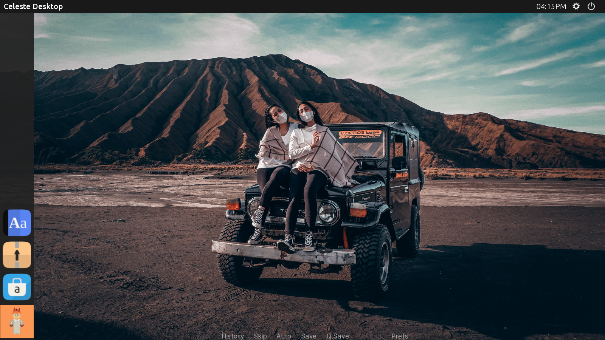

<h1></h1>

 

Candella is a fork of the [AliceOS framework](https://aliceos.app), a Ren'Py framework that provides an operating environment to visual novels. This operating environment includes utilities, classes, and other code that lets developers and players write and use apps designed for the system.

## Differences between AliceOS

- **Release compatibility**: Candella's release cycle syncs up with feature releases of Unscripted and the Ren'Py SDK, respectively.
- **Responsive feedback**: AliceOS follows a release schedule and doesn't update as quickly with bug fixes or improvements, Candella gets feedback from the public as well as playtesters in the [Unscripted Playtesting Program][uvn-beta].
- **Targeted for Unscripted**: Candella will add new features and improvements that will be helpful for Unscripted, such as native support for the NadiaVM language.
- **Simplified app development**: Candella's application framework extensions make it easier to develop apps quickly without fiddling through delegate calls.

## Getting started

### Quick start: Get Candella

Unscripted comes bundled with the latest release of Candella and can be copied to any Ren'Py project. In the game's files, copy the 'candella.rpa' archive to your Ren'Py project.

You can additionally download a release from [the Releases page][releases].

### Build from source

#### Requirements
- [Ren'Py SDK][renpy] v7.4.0 or greater
- Python 3
- Pipenv

Clone the repository from GitHub, then run `pipenv install -d` in the root of the project to fetch dependencies for making the project.

To build this project, open the Ren'Py Launcher, click "Distribute" and select "Candella System Distributable". The resulting file will be in a ZIP archive with `candella.rpa`.

#### Test-drive features

If you want to test out some of the features without building anything, clone the repository and launch the project from the Ren'Py launcher.

## License

Candella is licensed under the BSD-2-Clause license per the licensing of the original AliceOS project.

<!-- Links -->

[releases]: https://github.com/UnscriptedVN/candella/releases/
[uvn-beta]: https://beta.unscriptedvn.dev
[renpy]: https://renpy.org