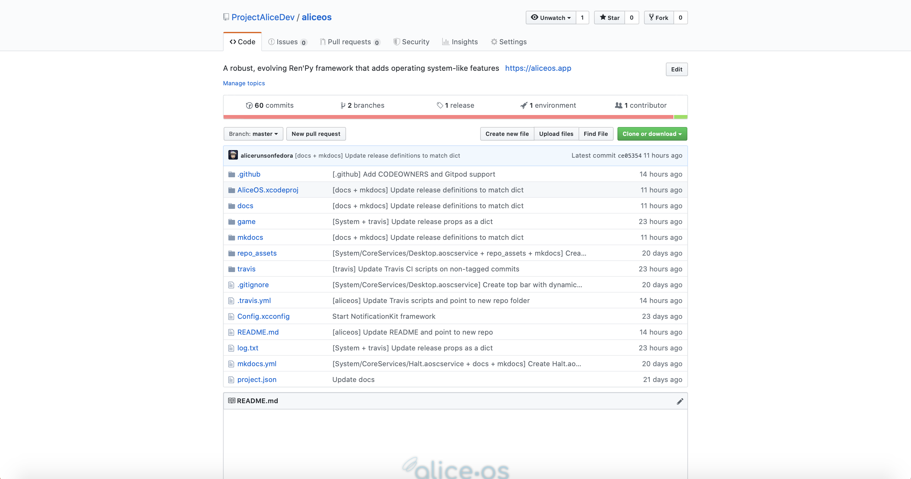

# Contribution Guidelines

AliceOS is free and open-source software, hosted on GitHub, and accepts contributions from the community. To make the contribution process quick, smooth, easy, and fun, we've devised a set of guidelines to ensure code quality and security. Please consult these when making a pull request, issue, etc.

## General Code Guidelines

These guidelines apply to code that is written in AliceOS.

### Follow the AliceOS API Styling

Although AliceOS is a Python-based framework, our APIs are similarly written to those of the APIs used when creating macOS and iOS apps and are in camel case. This usually serves two purposes:

- To identify AliceOS code from the rest of a visual novel project
- To make it easy to understand when migrating from Apple platform development

> Example: `applicationWillRequestNotification` vs. `application_will_request_notification`

System-wide variables such as release names should be capitalized and use snake case as normal.

> Example: `AS_SYS_VERSION` vs. `asSysVersion`

### Follow commit conventions

The AliceOS team has adopted the same [commit conventions from Clarity](https://github.com/ClarityMoe/Community/blob/master/CHAPTER3-COMMIT%20CONVENTIONS.md), the parent organization running Sayonika. This commit style definitely explains where changes occured and what was changed in a succinct manner. However, there are some changes we have made to this commit style:

- Common directories such as System, Applications, and Library do _not_ need to be fully typed out.
- File extensions for frameworks (`.aosframework`), core services (`.aoscservice`), and applications (`.aosapp`) do _not_ need to be typed out.

> Example: `[S/F/ServiceKit] Resolve misnaming of serviceWillRequestNotification from applicationWillRequestNotification`

### Keep code organized

The AliceOS structure is organized based on a simple macOS file structure to make everything easy to locate. Please try to keep this organization when contributing your code.

## Issues

These guidelines apply to issues on GitHub.

### Be as descriptive and concise as possible

So that AliceOS contributors and developers can better understand what the issue or request may be, issue descriptions should be concise but also descrptive. Refrain from writing an issue in a convoluted way that confuses others.

Additionally, if you feel using a screenshot or video will better illustrate your description, add them in conjuction with (or to replace) the description. Remember to consult the [Screenshot Guidelines](#screenshots).

### Label your issue during creation

Issues are categorized by types such as `bug`, `enhancement`, `question`, etc. by contributors that can access labels. Since it isn't possible to tag an issue during creation, prepend the tag to your issue's title.

> Example: [Bug] applicationShouldRequestNotification always returns False

## Pull Requests

These guides apply to pull requests on GitHub.

### Describe all of your changes

Pull requests generally include many changes that address a particular problem or a set of problems. Explain all of the changes you made; you may also specify the subsystems (directories) by using the commit message style.

> Example:
> This PR makes the following changes:
>
> - [S/F/ServiceKit] Renames `applicationWillRequestSync` to `serviceWillRequestSync`
> - [S/A/Messages] Adds new `MessagesView` to view conversation history

### Reference existing issues and PRs

If applicable, pull requests will reference the issues they are fixing in the description. This helps organize contributions in a few ways:

- Automates closing issues when they are fixed
- Verifies that the pull request fixes the issue(s) in question
- Makes a reference in the issue's thread for context

If there are any documented issues that the pull request addresses, reference them in the description of the pull request.

> Example:
>
> - [S/A/Logokas] Resolve `applicationShouldRequestLogokasPermission` to correct booleans (fixes #1)

## Screenshots

These guidelines apply to screenshots that are used for reference in issues and/or pull requests.

### Respect the user's/developer's visibility

Make sure that your screenshots don't display personally-identifiable information. When possible, try to use fake data designed for testing instead of real data.

### Ensure screenshots are clear

Screenshots are often included to help illustrate or demonstrate a point with an issue or pull request. It may be difficult to understand the screenshot's purpose if the image is too small or distorted. Ensure that all screenshots are clear and visible.

## For Official Contributors

For official developers and Project Alice members, there are some additional guidelines to follow to ensure that code is signed and verified:

### Sign off your code and enable verified commits

Verified commits let developers, contributors, and users know that the code they are working with is from a trusted source. These commits are signed using GPG or S/MIME and are verified on GitHub.  It is _**mandatory**_ that AliceOS developers and Project Alice members set up verified commits on their device(s) and any tools to digitally sign their code when pushing to GitHub.

More information can be found on [GitHub's support page](https://help.github.com/en/articles/managing-commit-signature-verification).
