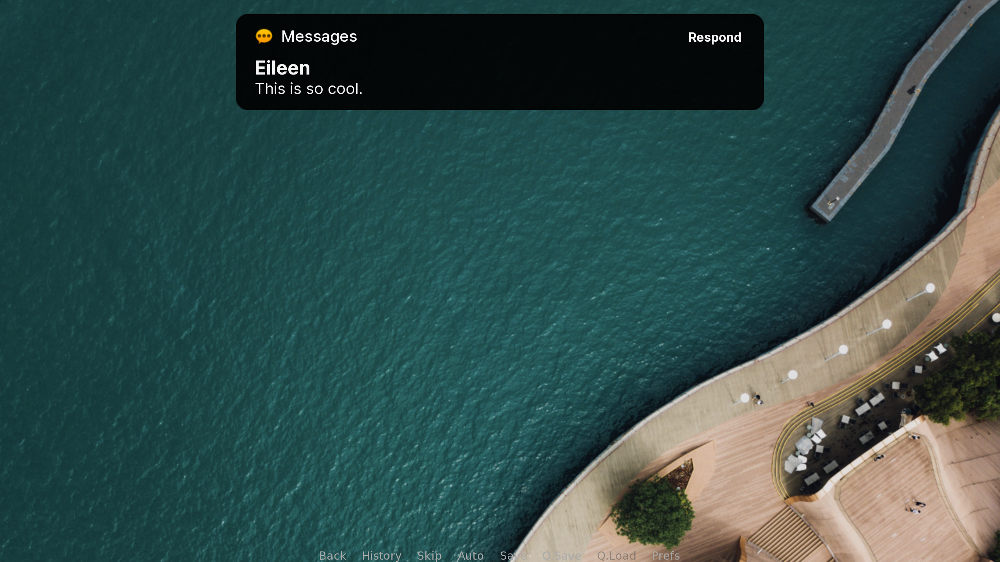

#  Sending Notifications



Notifications are a great way to extend your visual novel project. If done correctly, they often can add an interactive experience that immerses players into the environment. Apps using AppKit have a way to send notification requests to the user that also respect's users' preferences.

## Declaring notification permissions

Your app should have the proper permissions to send notifications via NotificationKit in the app's manifest. To ensure that your app lists itself as needing this permission, be sure to add `AS_REQUIRES_NOTIFICATIONKIT` into the `requires` field:

```python

requires = {
    AS_REQUIRES_NOTIFICATIONKIT,
    ...
}
```

## Requesting for permission

Typically, apps request for notification access before sending notification requests. There are two methods for handling this behavior:

- `requestAllPermissions()` will request for all permissions available. Use this only if notifications are dependent on other permissions that must be addressed immediately.
- `requestPermission(forPermission=AS_REQUIRES_NOTIFICATIONKIT)` will request specifically for the NotificationKit permission.

## Sending a temporary notification request (banner)

Apps using AppKit have an official means of handling temporary notifications as banners via several methods. More details are provided on the [Banners page](../Frameworks/NotificationKit/01-banner.md).

### `applicationShouldRequestNotification()`

This function is provided to check that the app has been given permission to send notifications.

**Returns**

- Whether the app has been given permission to send notifications as a Boolean value.

!!! danger
    Do not override this function unless you need to perform an additional check.

### `applicationWillRequestNotification()`

**Parameters**

- `message`: The message or title of the notification.
- `withDetails`: The details of the notification.
- `responseCallback` (Optional) The action to perform when clicking 'Respond'.

!!! tip
    If there are preliminary actions that should be performed _before_ requesting a notification, you may redefine the function, granted that you also include `ASAppRepresentative.applicationWillRequestNotification()`.
    
    **Example**
    
        
        def applicationWillRequestNotification(self, message, withDetails, responseCallback):
            if not "Error" in message:
                ASAppRepresentative.applicationWillRequestNotification(
                    message, 
                    withDetails, 
                    responseCallback)
            else:
                print "(Err: " + message + ") " + withDetails
                
!!! danger
    Do not use any other methods for sending temporary notifications that do not listen to `applicationShouldRequestNotification()`. All notifications should adhere to users' preference.

### `applicationDidRequestNotification()`

`applicationDidRequestNotification()` runs after a notification has been sent. This can be used to watch for a particular action or to do something else.

### Guidelines

Banners are intended for temporary actions that can be ignored, if possible. Keep these guidelines in mind when using banners:

- **Refrain from overloading banners**. This can be visually distracting and may annoy the user.
- **Keep the message and details short**. Banners are intended for a quick glance or something that doesn't require a lot of attention.
- **Don't force the user to interact with the banner**. Banners shouldn't require the user to perform an action.

## Sending an alert request

Apps using AppKit can also make use of alerts to present immediate information to the user and ask for an action. Details on how alerts work can be found in the [Alerts documentation](../Frameworks/NotificationKit/02-alerts.md).

### applicationWillRequestBasicAlert(message, withDetails, onDismissCallback)

Display a basic alert with a title, message, and a callback when 'OK' is clicked.

**Parameters**

- `message`: The message or title of the alert.
- `withDetails`: The details of the alert.
- `onDismissCallback` (Optional) The action to perform when clicking 'OK'.

### `applicationWillRequestExtendedAlert(message, withDetails, primaryActionText, onPrimaryCallback, secondaryActionText, onSecondaryCallback)`

Display an alert with a title, message, and two action with respective callbacks.

**Parameters**

- `message`: The message or title of the alert.
- `withDetails`: The details of the alert.
- `primaryActionText`: The text for the primary action button
- `onPrimaryCallback` (Optional) The action to perform when clicking the primary button.
- `secondaryActionText`: (Optional) The text for the secondary action button
- `onSecondaryCallback` (Optional) The action to perform when clicking the secondary button.

### `applicationDidRequestAlert()`

`applicationDidRequestAlert()` runs after an alert has been displayed. This can be used to watch for any other events during the alert process.

### Guidelines

- **Refrain from overloading alerts.** Alerts can be seen as intrivusive if too many are displayed at one time. Unless the user needs to make an immediate decision, refrain from using an alert.
- **If the content isn't important, consider a banner.** Banners are less intrusive by nature and don't require an immediate action.


## Suggested documentation

- [Notification banners](../Frameworks/NotificationKit/01-banner.md)
- [Notification alerts](../Frameworks/NotificationKit/02-alerts.md)