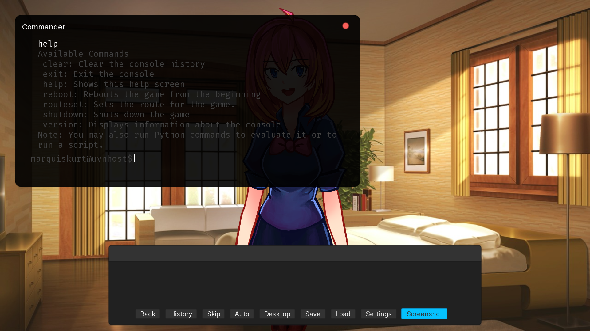

# Giving your App an Interface



Some apps may want to provide a user interface for players to work with to manage settings or work with things in-game. AppKit works hand-in-hand with Ren'Py's screens and makes it easy to work with a Ren'Py-defined UI. AliceOS also comes with ScreenKit, a great way to define an interface that's designed for AliceOS.

## Attaching a screen to your app

Apps that want to display an interface when their icon is clicked in Activities or the App Manager should show the screen in their `applicationWillLaunch` method, like so:

```
def applicationWillLaunch(self):
    renpy.show_screen("screenname")
```

Although it's recommended to design the app's interface with ScreenKit for consistency, this will work for any screen defined in a Ren'Py project.

## Creating an interface with ScreenKit

Creating an interface with ScreenKit is relatively easy since ScreenKit works directly with Ren'Py's screen language. For an existing screen, it's easy to port it over to ScreenKit by adding the `style_prefix` property at the top of the screen:

```renpy
screen my_screen():
    style_prefix "ASInterface"
    ...
```

If you are creating an interface from scratch, you can take a look at how to create a very basic UI using screen language and ScreenKit in [A Simple UI](../Frameworks/ScreenKit/01-a-simple-ui.md).

## Organizing screens in your app

Apps might have multiple screens and may lose track of what screen goes where. We recommend adopting a similar structure to the one below to keep your screens organized:

```
AppRoot/
    Resources/
    Views/
        ScreenName.rpy
        SecondScreen.rpy
    Styles/
        ScreenStyles.rpy
    AppManifest.rpy
```

## Suggested documentation

- [A Simple UI](../Frameworks/ScreenKit/01-a-simple-ui.md)
- [Special ScreenKit Styles](../Frameworks/ScreenKit/02-special-styles.md)