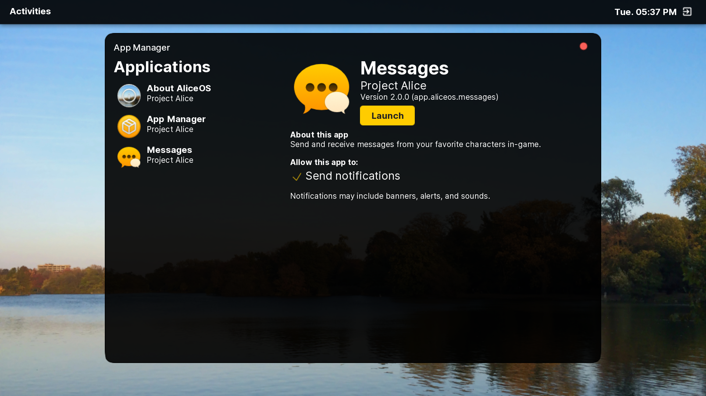

# Welcome

**Apps** are a fun and extensible means of further enhancing the AliceOS environment without needing to customize the base installation and recompile from source. Apps also take advantage of AliceOS's features and frameworks, such as NotificationKit and ScreenKit. To accomplish this, apps use AppKit, the official API set for writing custom apps for the AliceOS framework. 

## About this section

The following documentation will cover the important facets of creating an AliceOS app and what frameworks are available. It will also cover important guidelines that all AliceOS apps should follow to maintain security, privacy, and consistency.

