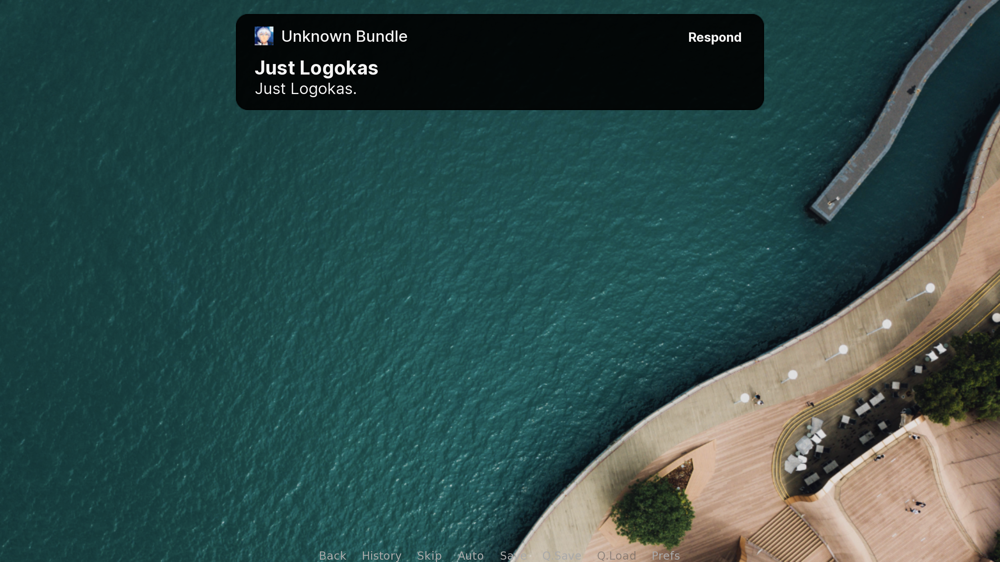

# Banners

**Banners** provide a temporary pop-up at the top of the screen that automatically dismiss after five seconds. Banners usually include an app's name, primary message, details, and a response callback upon clicking 'Respond'.

## `ASNotificationBanner()`

`ASNotificationBanner(applet=None, message, withDetails, responseCallback=Return('didClickRespond'))`

### Parameters

- `applet`: (Optional) The app object to pass in. If None, the app icon and bundle name on the top will display as "Unknown Bundle".
- `message`: (Required) The main message or sender.
- `withDetails`: (Required) The details of the message.
- `responseCallback` (Optional) The action to run upon clicking "Respond".

### Returns

- If the notification times out and dismisses, the banner will return `'notificationTimedOut'`.
- If the notification's response callback is left as the default, the banner will return `'didClickRespond'` when clicking the "Respond" button.