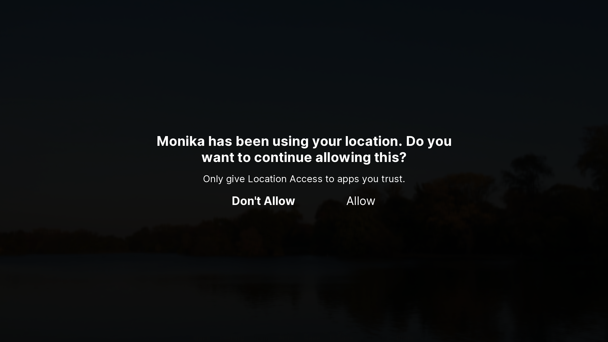

#  Alerts

**Alerts** provide important information for the user and request an immediate action. There are two types of alerts AliceOS has: basic and extended. Both types of alerts are designed to request an immediate action, though there are different uses for each alert type.

## `ASNotificationAlert()` (Basic)

`ASNotificationAlert(message, withDetails, onDismissCallback=Return('didDismissAlert'))`

### Parameters

- `message`: The message or title of the alert.
- `withDetails`: The details of the alert.
- `onDismissCallback` (Optional) The action to perform when clicking 'OK'.

### Returns

- If the `onDismissCallback` remains at the default, the alert returns `'didDismissAlert'`.

&nbsp;

## `ASNotificationExtendedAlert()` (Extended)

`ASNotificationExtendedAlert(message, withDetails, primaryActionText, onPrimaryCallback=Return('didClickPrimary'), secondaryActionText=None, onSecondaryCallback=Return('didClickSecondary'))`

### Parameters

- `message`: The message or title of the alert.
- `withDetails`: The details of the alert.
- `primaryActionText`: The text for the primary action button
- `onPrimaryCallback` (Optional) The action to perform when clicking the primary button.
- `secondaryActionText`: (Optional) The text for the secondary action button. If set to `None`, the secondary action button will not be displayed.
- `onSecondaryCallback` (Optional) The action to perform when clicking the secondary button.

### Returns

- If the user clicks the primary action button and the action callback is left at the default, the alert returns `'didClickPrimary'`.
- Likewise, if the user clicks the secondary action button and the action callback is left at the default, the alert returns `'didClickSecondary'`.

