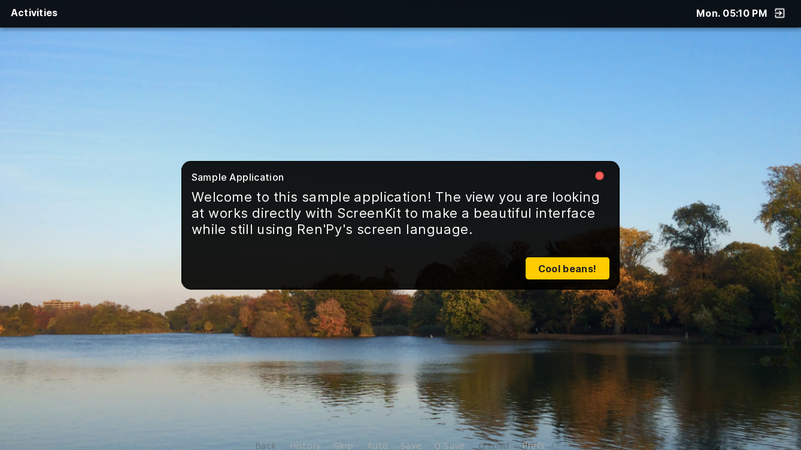

# A Simple UI



ScreenKit works beautifully with Ren'Py's screen language, a mostly-declarative and direct means of defining screens. Most of ScreenKit's UI magic works in such a way where, most of the time, you'll only need to add one extra line to your existing screen.

!!! tip
    All of the examples provided in the documentation will use screen language instead of dynamic creation with Python. If you are unfamiliar with Ren'Py's screen language, we recommend that you read about it and how it works on the official documentation. [Get started &rsaquo;](https://www.renpy.org/doc/html/screens.html)
    
## Creating a simple UI

For this simple example, we'll create the UI seen at the top of this documentation page as part of an app called "Samples". The screen includes a few elements:

- Window title bar with window controls
- Vertical box with text and a button

To get started, we'll need to first define our screen. Generally, AliceOS screen naming conventions follow that of the app's class:

```renpy
screen SamplesAppView():
```

We also have provided an empty parameter list since later versions of Ren'Py require a parameter list.

Now that we've created the screen itself, we'll need to tell it to use ScreenKit to style the elements; otherwise, the screen will use the default GUI included in the visual novel. To do this, we need to set the screen's `style_prefix`, meaning that any styles in this screen are named starting with `ASInterface`.

```renpy
screen SamplesAppView():
    style_prefix "ASInterface"
```

Now that we have created a blank screen, we'll need to define a window frame, where the contents of the interface will be stored, as well as its maximum size:

```renpy
screen SamplesAppView():
    style_prefix "ASInterface"

    frame:
        xalign 0.5 # Align it to the middle of the display
        yalign 0.5 # Align it to the center of the display
        xmaximum 700 # This is the biggest the frame can get
        ymaximum 600 # This is the tallest the frame can get
```

The frame will now appear in the center of the display and will be at most 700 pixels wide and 600 pixels tall. By default, most ScreenKit UIs will be at most 1248 pixels wide and 688 pixels tall.

!!! warning
    UIs built with ScreenKit should not be bigger than the maximum size of the game window (1280 pixels wide and 720 pixels tall). If it goes beyond this limit, the interface may get cut off.

Now that we have a frame in place, we need to create the area where the content will appear. To do so, we'll need to create a vertical box:

```renpy
screen SamplesAppView():
    style_prefix "ASInterface"

    frame:
        xalign 0.5
        yalign 0.5
        xmaximum 700
        ymaximum 600

        has vbox:
            xalign 0.5
            yalign 0.5

```

Any content inside of the `has vbox` statement will appear inside of the vertical box and not interfere with anything else. We can now try to attach our screen to our SamplesApp by telling it to show the screen when the application is open under the app's `applicationWillLaunch` method in the manifest:

```python
def applicationWillLaunch(self):
    renpy.show_screen("SamplesAppView")
    return
```

!!! note
    We used the method `renpy.show_screen` to show this screen rather than `renpy.call_screen`. If the app is launched while in an existing screen like the AliceOS Desktop, Ren'Py won't be able to call it because it would interrupt the current screen's interaction.
    
    However, you can get around this by using `renpy.invoke_in_new_context` so that the screen is in a different context from the default:
    

            renpy.invoke_in_new_context(renpy.call_screen, "SamplesAppView")

    
    This method will also allow any return values to be passed in.

After launching the app in either the Desktop or from App Manager, we can see that a frame is visible, but there isn't a title bar, and you can't exit the screen. To fix this, we'll need to call `ASInterfaceTitlebar`, a screen component:

```renpy
screen SamplesAppView():
    style_prefix "ASInterface"

    frame:
        xalign 0.5
        yalign 0.5
        xmaximum 700
        ymaximum 600

        has vbox:
            xalign 0.5
            yalign 0.5

            use ASInterfaceTitlebar("Sample Application", onClose=Hide("SamplesAppView"))
```

When we launch the application again this time, we will see our title bar and can click the close button to close out of the screen.

!!! note
    In our `onClose` parameter, we specified the `Hide` screen action rather than `Return`. Since we didn't call the screen from a new context, we opted for `Hide` since it would hide the screen without closing out of the AliceOS desktop.

## Adding content to our UI

Now we've set up a basic interface, we can start adding the rest of the interface, what we'll call the _content_.

Since we're making just a basic interface, we can just add the text and our button inside of the `vbox`:

```renpy
... # This is inside the screen from before
has vbox:
    xalign 0.5
    yalign 0.5
    
    use ASInterfaceTitlebar("Sample Application", onClose=Hide("SamplesAppView"))

    text """\Welcome to this sample application! The view you are looking at works directly with ScreenKit to make a beautiful interface while still using Ren'Py's screen language."

    hbox:
        xalign 1.0
        yalign 1.0

        textbutton "Cool beans!" action Hide("SamplesAppView"):
            style "ASInterfacePushButton"
```

Note that for our push button, we wrapped it in a horizontal box (`hbox`) and added `xalign 1.0` to move all the items to the right, as well as `yalign 1.0` to keep them at the bottom of the window. This can be useful if you have multiple buttons and want to keep them at the right.

Also, for the push button, we added an additional `style` property to the push button style, `ASInterfacePushButton`. This lets us use the AliceOS style for push buttons; otherwise, they would default to the text buttons AliceOS uses.

Now we can open the application and verify that it looks exactly the way we want and that clicking "Cool beans!" closes the window as expected.

## Finished code

Here is the final code for our screen:
```renpy
screen SamplesAppView():
    style_prefix "ASInterface"

    frame:
        xalign 0.5
        yalign 0.5
        xmaximum 700
        ymaximum 600

        has vbox:
            xalign 0.5
            yalign 0.5

            use ASInterfaceTitlebar("Sample Application", onClose=Hide("SamplesAppView"))

            text """\Welcome to this sample application! The view you are looking at works directly with ScreenKit to make a beautiful interface while still using Ren'Py's screen language."

            hbox:
                xalign 1.0
                yalign 1.0
        
                textbutton "Cool beans!" action Hide("SamplesAppView"):
                    style "ASInterfacePushButton"

            
```