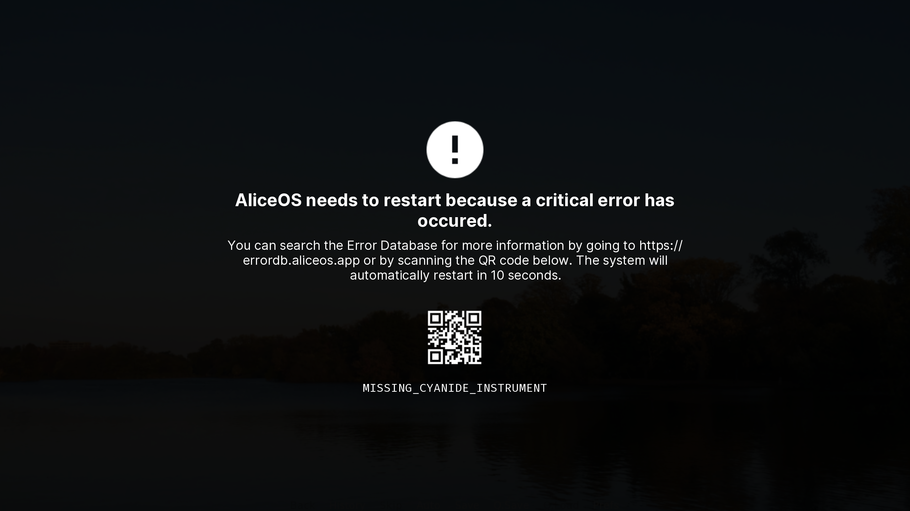

#  Critical Errors

If AliceOS encounters a critical error where it needs to restart to continue, the user will see the above warning and the system will restart automatically after 10 seconds. An error code is provided at the bottom and a QR cose is present to search the error on the [Error Database](https://errordb.aliceos.app).

Critical errors and the halt screen is managed by the [Error Halt System (Halt), a Core Service](../03-core-services/#error-halt-system) and can be used to present errors that aren't already caught by the base AliceOS distribution.

## Displaying a halt

To display the halt screen with a respective error code, call `$ ASHalt.halt("ERR_CODE")`. The system will display the halt and automatically restart after ten seconds.

## Guidelines

Halt screens should be used to catch important, critical errors.

- **Make your error code descriptive.** The user should be able to get an idea of what the problem might be from the error code itself. For instance, "`MISSING_CYANIDE_INSTRUMENT`" is more descriptive than "`INSTRUMENT_FAIL`".
- **Make sure your error is searchable in the database.** The user should be able to search for your error in the Error Database to investigate what went wrong.
- **Don't call the halt screen for a non-critical error.** The halt screen is designed to present immediate and important information to the user about a potential error that could damage AliceOS or your game in some way. It shouldn't be used to present an app-wide or section-wide error as the screen is rather intrusive.
