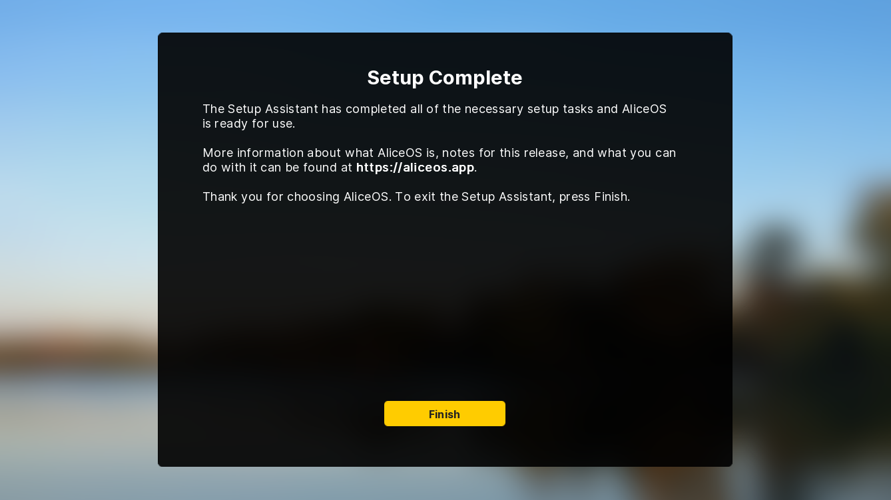

#  Setup Assistant



The Setup Assistant is a first-run tool designed to set any initial settings and/or configurations for AliceOS before starting the visual novel. It also lets the user create a username as well as read over and legel agreements or disclaimers the game creator has provided.

!!! tip Express Mode
    Starting with AliceOS Prospect Park, the Setup Assistant is automatically configured to use Express Mode, which skips a lot of the onerous steps in the original process. However, for a more thorough experience, Express Mode can be turned off.

## Automatic Setup

In the Bootloader, the Setup Assistant will run if it doesn't detect that any setup was done. This check is done via `persistent.AS_COMPLETED_SETUP`. The boot loader's `boot()` method contains parameters to customize the Assistant's modes and any additional disclaimers, if necessary.

## Manual Setup

If you want to call the Setup Assistant manually, you can use `ASSetup.startSetup()` to call the Assistant at any time.

### `startSetup(express=True, disclaimer=None)`

**Parameters**

- `express`: Whether Express Mode is enabled. The default is set to True.
- `disclaimer`: A string containing any disclaimers or legal agreements. If set to None, the Setup Assistant will skip this step.

**Returns**

The Setup Assistant will return `persistent.playername` if it is deemed necessary for use.

## Adding steps to the Setup Assistant

The Setup Assistant can be further customized by editing `startSetup()` in the core service file. The function calls the `ASSetupAssistantView` to display the step as a slide and collect any information if necessary. For example:

```python
renpy.call_screen("ASSetupAssistantView", 
                    title="Create Your Username", 
                    instructions="Type in a username that you want to use while using AliceOS. This name will also appear as your character name if applicable.", 
                    useInputMethod=True)
```

### `ASSetupAssistantView(title="Setup Assistant", instructions, useInputMethod=False, completed=False)`

**Parameters**

- `title`: The title of the step or slide.
- `instructions`: A brief description or set of instructions of what needs to be done on the step.
- `useInputMethod`: Whether to hide the 'Next' button and insert a text field instead.
- `completed`: Whether to change the 'Next' button text to 'Finish'.

**Returns**

If the screen is called using `renpy.call_screen()`, the following is returned:

- For steps that do not use the input method, `'didCompleteStep'` is returned.
- For steps that use the input method, the input is returned as a string.
