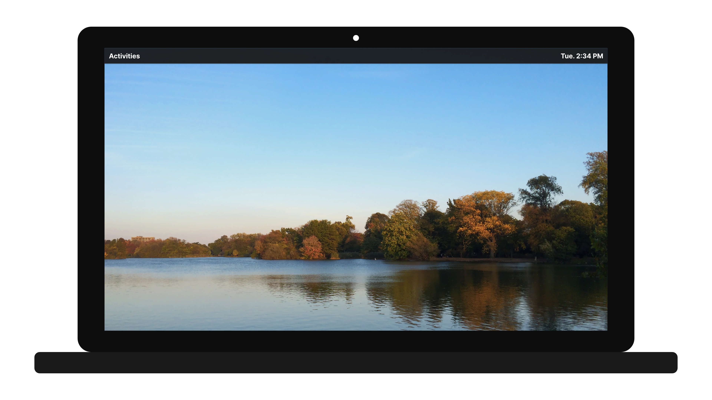

#  Welcome

 

AliceOS is a robust and evolving framework for developing interactive visual novel experiences with operating system-like features such as notifications and setup assistants.

## Features and Principles

The core principles of AliceOS are: 

- **Modular**: AliceOS uses a new framework format, under the `.aosframework` format. These frameworks are placed in the `System/Frameworks` folder and are not heavily reliant on AppKit.aosframework. However, the definitions file that states the default directories and what-not must be included in the System folder (including fonts).
- **Apple-style APIs**: AliceOS's APIs aim to be easy-to-use and familiar to developers that have worked with APIs for macOS, iOS, tvOS, and watchOS.
- **Safely extensible**: AliceOS includes support for extending itself with apps that are protected using appropriate, official APIs.
- **Easy-to-install**: AliceOS installation is as easy as just copying the Ren'Py archive over to the game folder.
